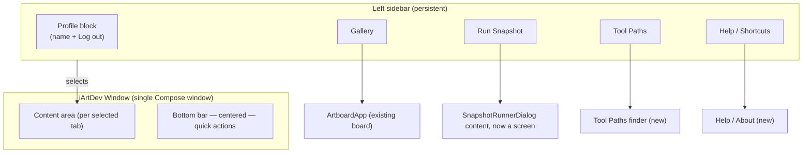
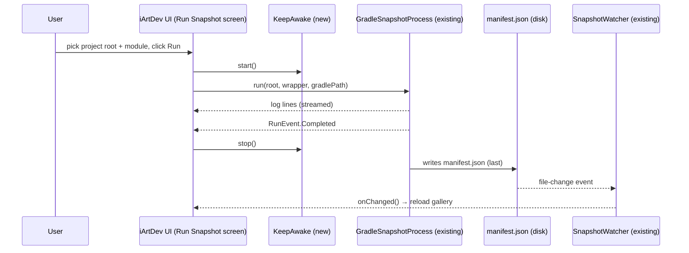
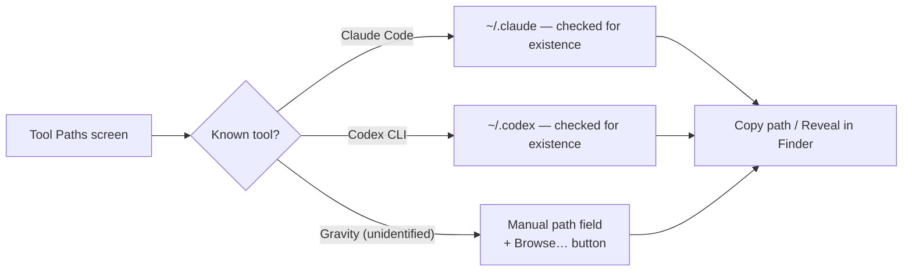

# iArtDev Redesign — Plan, Flow, Decision Log

Status: **in progress**. This file is the single source of truth for scope,
architecture, and the assumptions made while the requirements were still
being worded out loud. Update it as decisions change — do not let it drift
from the code.

## 1. Goal (as given)

> Turn iArtDev from a single-purpose snapshot viewer into a fuller desktop
> app: bottom nav bar (centered) + left sidebar of actions, a local
> user/session with logout, a modern logo/font, an "I don't know which
> module to inject" path-finder extended to other AI CLI tools (Claude,
> Codex, "Gravity"), a one-click copy of the `./gradlew … artboardSnapshot`
> command for people who don't want to type it, whatever else genuinely
> helps someone understand/operate the app, and the render job should
> survive the display sleeping.

## 2. Scope — what's in, what's deferred

| Item | Status | Notes |
|---|---|---|
| Left sidebar (Gallery / Run Snapshot / Tool Paths / Help) | **In scope** | Replaces the current single-screen `Onboarding` → dialog flow with a persistent shell. |
| Bottom bar, centered | **In scope** | Secondary quick-actions (theme toggle, sync/re-run, folder), not a duplicate of the sidebar. |
| Local "session" (name, logout) | **In scope, scoped down** | No real auth — see Decision D1. |
| Modern font | **Already satisfied** | `Studio.type` already ships Space Grotesk (headings) / IBM Plex Mono (code) / FreeSans — see Decision D2. Reused, not replaced. |
| In-app vector logo mark | **In scope** | A drawn Compose mark, not a designer asset — see Decision D3. |
| Installer icon (`.icns` / `.ico`) | **Deferred** | Needs real image-authoring tooling I don't have in this environment; jpackage keeps its default icon until someone supplies one. |
| AI tool path finder (Claude / Codex / "Gravity") | **In scope, scoped down** | Path *discovery* only, never credential storage — see Decision D4. |
| Copy `./gradlew …` command button | **In scope** | Small, low-risk, directly requested. |
| Keep-awake during a running snapshot job | **In scope, scoped down** | Tied to the job's lifecycle, not permanent — see Decision D5. |
| "Other useful features" (open-ended) | **In scope, minimal** | Added: a Help/Shortcuts panel and an About panel. Not adding speculative features beyond that — see Decision D6. |

## 3. Architecture — screen shell

## 4. Run-snapshot flow (existing engine, new chrome)

`KeepAwake` is the only new node in this diagram — everything else
(`GradleSnapshotProcess`, `SnapshotWatcher`, manifest parsing) is reused
as-is. This keeps the redesign additive rather than a rewrite.

## 5. Tool Paths finder — what it actually does

No credentials are read, stored, or transmitted anywhere — this screen
only resolves and displays filesystem paths, mirroring what
`GradleProjectScanner` already does for Gradle projects.

## 6. Decision log

### D1 — "Session" is a local display-name only, not real auth
The request says "cho vui càng tốt" (nice-to-have, not load-bearing) and
this is a single-user local desktop tool with no backend/server — there's
nothing to authenticate against. Implemented as: a name typed once,
persisted via `java.util.prefs.Preferences` (same mechanism as
`RecentFolders`), shown in the sidebar header, with a "Log out" action that
clears it and returns to a name-entry state. No password, no accounts, no
network calls. If real multi-user auth is ever wanted, that's a different,
much bigger feature and should be scoped separately.

### D2 — "Modern font" is already satisfied by the existing design system
`artboard.host.StudioTheme` (`Studio.type`) already defines Space Grotesk
for headings/labels and IBM Plex Mono for code/paths — both contemporary,
already used consistently across Artboard's board chrome and iArtDev's own
amber theme. Introducing a second font family would fight the existing
design language rather than modernize it. Decision: reuse `Studio.type`
everywhere in the new screens; do not add a new font.

### D3 — Logo is an in-app vector mark, not a binary asset
I can draw a simple Compose `Canvas` mark (monogram, using the existing
amber accent) that renders correctly in both themes at any size. I cannot
responsibly hand-produce a production `.icns`/`.ico` app-icon file — that
needs real image tooling and design judgment a text-editing pass can't
substitute for. The vector mark covers the in-app sidebar branding ask; the
installer icon is logged as deferred (see Scope table) rather than filled
with a placeholder that would ship to users' Dock/taskbar.

### D4 — "Inject codex, gravity, claude" is implemented as path discovery, not credential injection
Read literally, "inject an account" for a desktop tool with no backend
would mean storing some secret — that's a security-sensitive feature I
won't invent the shape of on an assumption. What the user explicitly said
they liked ("cái này tôi thấy khá oke") is Artboard's *existing* pattern:
auto-detect a likely path, let the user confirm/override it, never handle
secrets. So "Tool Paths" reuses exactly that pattern for other CLI tools'
config directories:
- **Claude Code** → `~/.claude` (documented, well-known location)
- **Codex CLI** → `~/.codex` (documented, well-known location)
- **"Gravity"** → not a tool I can identify with confidence, so it gets a
  generic manual-path field (browse + validate-exists) instead of a guessed
  default. If "Gravity" refers to a specific product, tell me and I'll wire
  a real default path for it.

### D5 — Keep-awake is scoped to the active render job, not the whole app session
Running `caffeinate` (macOS) unconditionally for as long as iArtDev is open
would silently drain battery/prevent sleep with no user-visible reason.
Instead, `KeepAwake` starts exactly when `GradleSnapshotProcess.run(...)`
starts and stops exactly when it completes/fails/is cancelled — the
Robolectric render is the only part of this app that's slow enough to
matter, and it's the part the user explicitly wants to survive a screen-off
laptop lid. Windows/Linux have no direct equivalent implemented yet; noted
as a follow-up if this ships cross-platform demand.

### D6 — "Other useful features" kept deliberately small
The request explicitly invited invention here ("bạn có thể nghĩ thêm chỗ
này"). Rather than speculating a large feature set, two additions were
made that directly serve *understanding the app* (the stated intent):
a **Help / Shortcuts** panel (what each screen does, keyboard shortcuts)
and an **About** panel (version, links to this doc, links to the Artboard
README). Anything larger should be a separate, explicitly-scoped request.

## 7. Milestones

- [ ] M1 — This plan file (done once this commit lands)
- [ ] M2 — Nav shell: left sidebar + bottom bar, screens wired, existing
      Gallery/Run Snapshot behavior preserved
- [ ] M3 — Local profile/session (name, persisted, logout)
- [ ] M4 — Tool Paths finder (Claude/Codex detection + manual field)
- [ ] M5 — Copy-`./gradlew`-command action
- [ ] M6 — KeepAwake wired into `GradleSnapshotProcess` lifecycle
- [ ] M7 — Build green, version bump, PR, merge, tag, release

## 8. Non-goals (explicitly out of scope this pass)

- Real authentication/accounts/backend of any kind.
- Storing credentials or tokens for any third-party CLI tool.
- A visual design/drag-and-drop editor (that's the separate "Update
  Design" thread — not this one; see chat history for why those two were
  kept apart).
- Windows/Linux keep-awake equivalents (macOS only for now).
- A produced `.icns`/`.ico` binary app icon.
